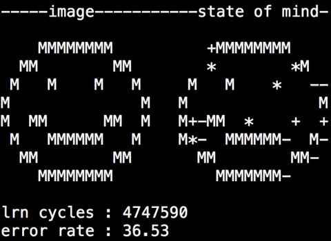

# libperceptron

These files implement a super simple perceptron library. This library was intended (and did) run on Atmel AVR
 microcontroller chips.

(c) 2003 by Leander Seige, leander@seige.name

## Demo 1 (universal.c)

An artificial neural net learns the ASCII art image on the left, current state of mind of the net is shown on the right.

## Demo 2 (example.c w/ Makefile)

This net learns the curve of a sine wave and displays its understanding on an LED bar.

sorry, no picture available

## License

RELEASED UNDER THE TERMS OF THE GNU GENERAL PUBLIC LICENSE, GPL

Please read the files example.c, perceptron.h and perceptron.c
to find out how to use it. I tried to give useful comments.

The function n_dump_net() is unusable, i wrote it for testing
purposes. But did not delete it because one could modify it to
print to a serial line connection, lcd displays or whatever.

There was a garbage collector to free() a neural net. I deleted
it to safe memory, but i could reimplement it if needed.

To compile the example program you need to modify the Makefile
of course!
